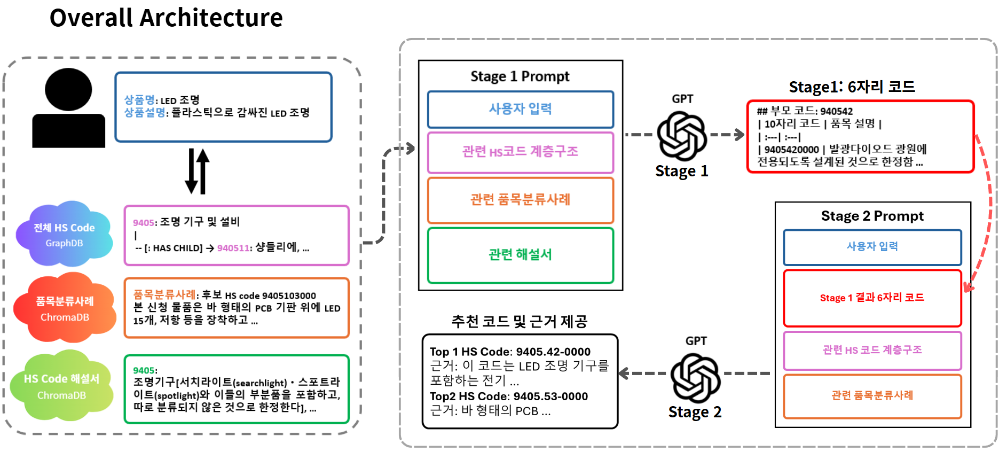
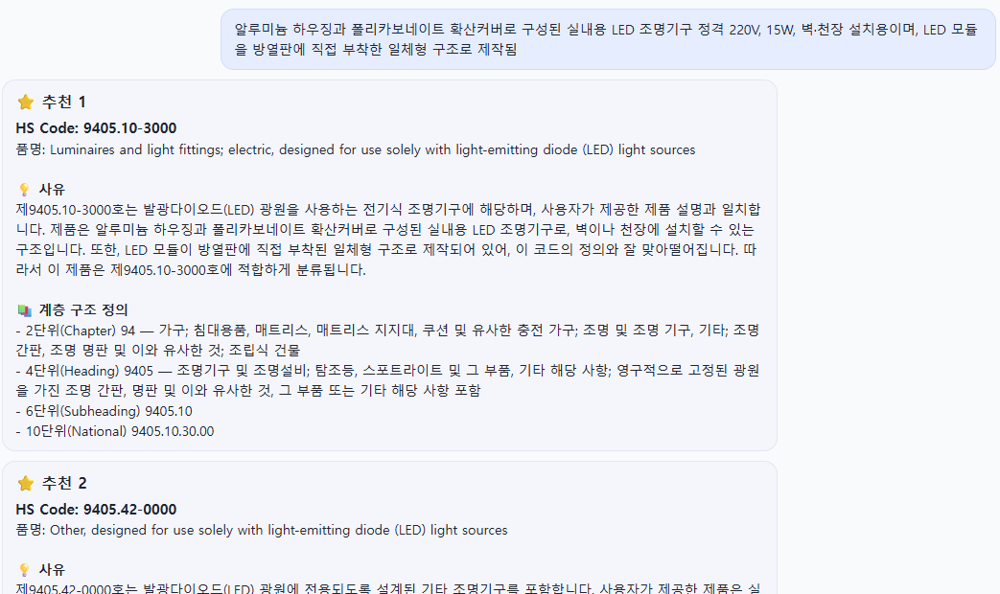

# LLM 기반 HS 코드 추천 시스템

> **목표**: 상품명/설명 같은 **텍스트 입력**만으로 HS 코드 **Top-K 후보**와 **설명 가능한 근거**를 구조화 JSON으로 제공합니다.  
> **핵심**: RAG 기반 검색 근거 + LLM 생성 

---

## 1) 개요

- **프로젝트명**: LLM 기반 HS Code Recommendation
- **과목**: 2025-2 DSCD  
- **목표**: 자연어로 입력된 상품 정보(상품명·설명)를 바탕으로 **HS 코드 Top-K**과 **근거 텍스트**를 반환

### 주요 제공 기능
- 🔎 **Top-N HS 코드 추천** (LLM + RAG)
- 📚 **근거 텍스트 제공**: 검색된 규정/해설/사례의 관련 문단을 함께 제시
- 🗄️ **다중 데이터베이스 지원**: Case  & Nomenclature ChromaDB (Vector DB) + Neo4j (Graph DB)
- 🏗️ **계층적 RAG**: 2단계(6자리→10자리) 분류
- 🧪 **평가 시스템**: 자리수별 정확도 제공


---

## 2) 시스템 아키텍처

```text
[입력(상품명·설명)]
         │
         ▼
  [전처리·키워드 추출] ──▶ [임베딩] ──▶ [다중 DB 검색]
         │                              │
         │                              ├─ ChromaDB (Vector Search)
         │                              ├─ Neo4j (Graph Search)
         │                              └─ Nomenclature ChromaDB
         │
         ▼
      [Stage 1: 6자리 예측]
         │
         ├─ 3개의 DB에서 검색된 컨텍스트 + LLM
         │
         ▼
      [Stage 2: 10자리 예측]
         │
         ├─ Stage 1 결과 하위 범위로 검색
         ├─ 검색된 컨텍스트 + LLM
         │
         ▼
      [최종 JSON 응답]
```

### 데이터베이스
- **Case ChromaDB**: 품목분류사례 검색 
- **Nomenclature ChromaDB**: HS 해설서 검색
- **Neo4j GraphDB**: HS 코드 계층 구조를 그래프로 표현하여 검색 (If graphDB is not recognized, you need to turn on the DB.)

[ChromaDB](https://drive.google.com/file/d/1xFnkGD6FRgempZxi2orwkOICGHQD2hUH/view?usp=sharing)


### 최종 모델 특징
- **임베딩 모델**: `text-embedding-3-large`
- **검색 모드**: ChromaDB + GraphDB + NomenclatureDB
- **분류 방식**: 계층적 2단계 RAG (6자리 → 10자리)
- **키워드 추출**: KoNLPy (Okt) 사용

---

## 3) 프로젝트 구조

```
2025-2-DSCD-FIVE-01/
├── LLM/                          # LLM 관련 코드
│   ├── .env                     # 환경 변수 (API 키 등)
│   ├── run_rag.py              # HS Code 분류 실행 스크립트
│   ├── rag_module.py           # RAG 모듈 (HSClassifier)
│   ├── rag_service.py           # RAG 서비스 (FastAPI/Chainlit용)
│   ├── chainlit_app.py          # Chainlit UI 애플리케이션
│   ├── evaluate.py             # 평가 스크립트
│   ├── graph_rag.py             # GraphDB RAG 클래스
│   ├── main.py                  # 메인 실행 파일
│   ├── Stage1_prompt.txt        # 계층적 1단계 프롬프트
│   ├── Stage2_prompt.txt        # 계층적 2단계 프롬프트
│   └── hscode_rule.txt          # HS 코드 규칙
│
├── Preprocessing/                # 데이터 전처리
│   ├── all_hscode_preprocessing.ipynb
│   ├── check_DB.py              # 데이터베이스 확인 스크립트
│   ├── exp_preprocessing.ipynb
│   ├── fill_data.py
│   └── RAG_embedding/            # 임베딩 및 RAG 관련 코드
│       ├── embedding_openai_large.ipynb  # OpenAI Large 임베딩 생성
│       ├── embedding_ver2.ipynb         # ChromaDB 임베딩 생성
│       ├── embedding.ipynb              # 임베딩 생성 (레거시)
│       ├── graph_embedding.py           # GraphDB 임베딩 생성
│       ├── nomenclature_chroma_embedding.py  # Nomenclature 임베딩
│       └── pdf_to_markdown.py           # PDF → Markdown 변환
│
├── Crawling/                     # 크롤링 관련
│   ├── code_count.ipynb
│   ├── crawling_remove_duplicate_rows_1005.ipynb
│   └── 크롤링_함수.ipynb
│
├── data/                         # 데이터 파일
│   ├── all_hscode.csv           # HS 코드 전체 목록
│   ├── hscode_*.csv              # HS 코드 관련 CSV 파일
│   ├── 관세율*.csv                # 관세율 관련 CSV 파일
│   ├── 품목분류사례_*.csv.zip     # 품목분류사례 데이터
│   ├── HS_code_Nomenclature.md   # HS 코드 명명법 문서 (Markdown)
│   ├── HS_code_Nomenclature.pdf  # HS 코드 명명법 문서 (PDF)
│   ├── chroma_db_openai_large_kw/  # ChromaDB 인덱스
│   └── nomenclature_chroma_db/  # 해설서 ChromaDB
│
├── backend/                      # FastAPI 백엔드
│   └── main.py                  # FastAPI 애플리케이션
│
├── frontend/                     # 프론트엔드
│   ├── index.html
│   ├── main.js
│   └── style.css
│
├── src/                          # React 프론트엔드 소스
│   ├── App.jsx
│   ├── index.js
│   ├── index.css
│   └── components/
│       ├── ProductInputForm.jsx
│       └── ResultList.jsx
│
├── assets/                       # 이미지 및 리소스
│   ├── Overall_Figure.png        # 시스템 아키텍처 다이어그램
│   └── Chatbot_Result.png        # 챗봇 출력 예시
│
├── requirements.txt              # Python 의존성
├── README.md                     # 프로젝트 문서
└── check.py                      # 유틸리티 스크립트

```

---

## 4) 설치 및 실행

### 4.1 요구사항
- Python 3.10
- openjdk 24.0.2
- Neo4j 데이터베이스 연결
- ChromaDB 데이터베이스 (경로: data/)
- 인터넷 연결 (LLM·임베딩 모델 사용 시)
- ngrok

### 4.2 의존성 설치
```bash

# 의존성 설치 (requirements.txt가 있다면)
pip install -r requirements.txt

```

### 4.3 환경 변수 설정
프로젝트 루트에 `.env` 파일을 생성합니다.

```env
# OpenAI API
OPENAI_API_KEY=your_openai_key

# Neo4j GraphDB 
NEO4J_URI=your_neo4j_url
NEO4J_USER=your_username
NEO4J_PASS=your_password
INDEX_NAME=hs_code_index

# ChromaDB
CHROMA_DIR=data/chroma_db_openai_large_kw
CHROMA_COLLECTION=hscode_collection

# 재현성
SEED=42
```

### 4.4 데이터베이스 준비

#### ChromaDB 인덱스 구축
```bash
# Jupyter 노트북 실행
jupyter notebook RAG_embedding/embedding_openai_large.ipynb
```

#### Neo4j GraphDB 설정
1. Neo4j 데이터베이스 설치 및 실행
2. HS 코드 데이터를 그래프로 로드
3. 벡터 인덱스 생성:
```bash
python RAG_embedding/graph_embedding.py
```
4. Neo4j GraphDB Connect 상태 유지

---

## 5) 사용 방법

### 5.1 실행 (CLI)

#### 최종 모델 실행 (계층적 2단계 RAG)
```bash

python LLM/run_rag_final.py \
  --name "LED 조명" \
  --desc "플라스틱 하우징에 장착된 LED 조명 모듈" \


```

### 5.2 실행 (FastAPI 서버)
```bash
uvicorn backend.main:app --host localhost --port 8000
```

서버 실행 후 브라우저에서 `http://localhost:8000` 접속하여 웹 UI 사용 가능

### 5.3. ngrok 임시 배포

5.2의 FastAPI 서버 실행 후 새로운 터미널에서 아래 코드를 통해 임시 url 생성 

```bash
ngrok config authtoken {YOUR_NGROK_TOKEN}
ngrok http 8000
```
---

## 6) 입력/출력 형식

### 6.1 입력
- **상품명** (`--name`): 상품의 이름
- **상품 설명** (`--desc`): 상품에 대한 상세 설명

### 6.2 출력 예시(JSON)
```json
{
  "candidates": [
    {
      "hs_code": "8539.50-1000",
      "title": "LED 조명",
      "reason": "LED 조명은 전기 조명 기구로 분류됩니다. 제공된 상품은 플라스틱 하우징에 장착된 LED 조명 모듈로, HS 코드 8539.50-1000에 해당합니다...",
      "citations": [
        {
          "type": "graph",
          "code": "8539.50"
        },
        {
          "type": "case",
          "doc_id": "case_001"
        }
      ],
      "hierarchy_definitions": {
        "chapter_2digit": {
          "code": "85",
          "definition": "전기 기계류 및 그 부분품"
        },
        "heading_4digit": {
          "code": "8539",
          "definition": "전기 조명 기구"
        },
        "subheading_6digit": {
          "code": "8539.50",
          "definition": "LED 조명 기구"
        },
        "national_10digit": {
          "code": "8539.50-1000",
          "definition": "LED 조명 모듈"
        }
      }
    }
  ],
  "step1_6digit_codes": ["8539.50", "9405.40"],
  "inference_time_seconds": 2.345
}

```

**주요 필드 설명:**
- `candidates`: 추천된 HS 코드 후보 배열 (최대 top_k개)
  - `hs_code`: 10자리 HS 코드 (예: "8539.50-1000")
  - `title`: 상품명 또는 제목 (선택적)
  - `reason`: 해당 코드를 추천한 이유 (한국어, 상세 설명)
  - `citations`: 검색 근거 배열
    - `type`: "graph" (GraphDB 근거) 또는 "case" (VectorDB 근거)
    - `code`: GraphDB 근거인 경우 HS 코드
    - `doc_id`: VectorDB 근거인 경우 문서 ID
  - `hierarchy_definitions`: HS 코드 계층별 정의
    - `chapter_2digit`: 2자리 장(Chapter) 정의
    - `heading_4digit`: 4자리 호(Heading) 정의
    - `subheading_6digit`: 6자리 소호(Subheading) 정의
    - `national_10digit`: 10자리 국가 세분류 정의
- `step1_6digit_codes`: 1단계에서 예측된 6자리 코드 배열
- `inference_time_seconds`: 추론 소요 시간 (초)

### 6.3. Chatbot 출력 예시


---

## 7) 주요 기능 상세

### 7.1 계층적 RAG (2단계)
- **Stage 1 (6자리 예측)**: 
  - ChromaDB + GraphDB에서 관련 사례 및 계층 정보 검색
  - Nomenclature 문서에서 관련 규정 검색
  - LLM을 통해 상위 6자리 코드 예측
- **Stage 2 (10자리 예측)**:
  - Stage 1에서 예측된 6자리 코드 하위에서만 검색 범위 제한
  - ChromaDB + GraphDB에서 해당 6자리 코드 하위 사례 검색
  - Nomenclature 문서에서 해당 섹션 검색
  - LLM을 통해 최종 10자리 코드 예측

### 7.2 다중 데이터베이스 통합 검색
- **ChromaDB (Vector Search)**: 유사한 품목분류 사례 검색
- **GraphDB (Graph Search)**: HS 코드 계층 구조를 활용한 검색
- **Nomenclature ChromaDB**: HS 공식 명명법 문서 검색 (항상 사용)

---

## 8) 참고 자료

- HS 코드 공식 명명법 문서: `data/HS_code_Nomenclature.md`
- 프롬프트 템플릿: `LLM/Stage1_prompt.txt`, `LLM/Stage2_prompt.txt`
